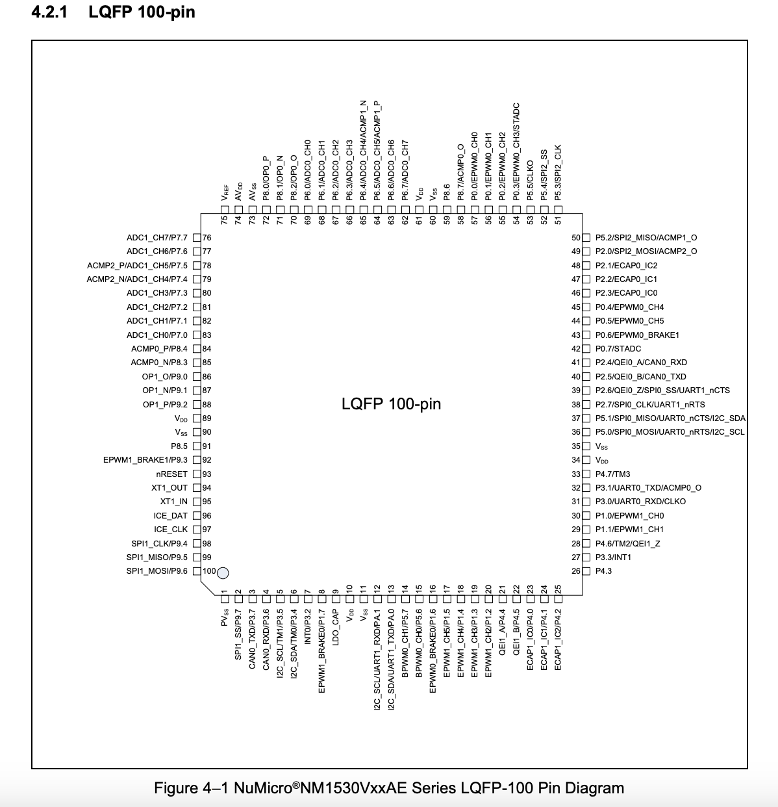
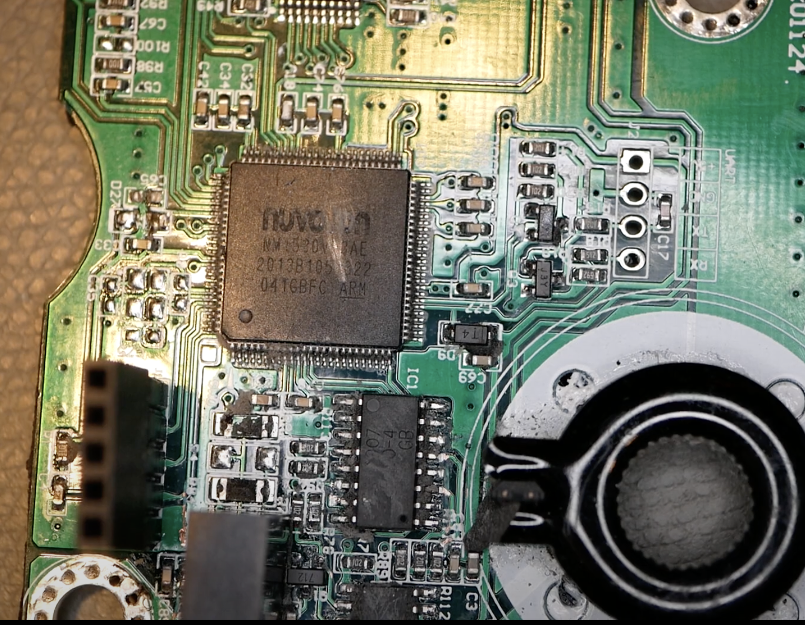
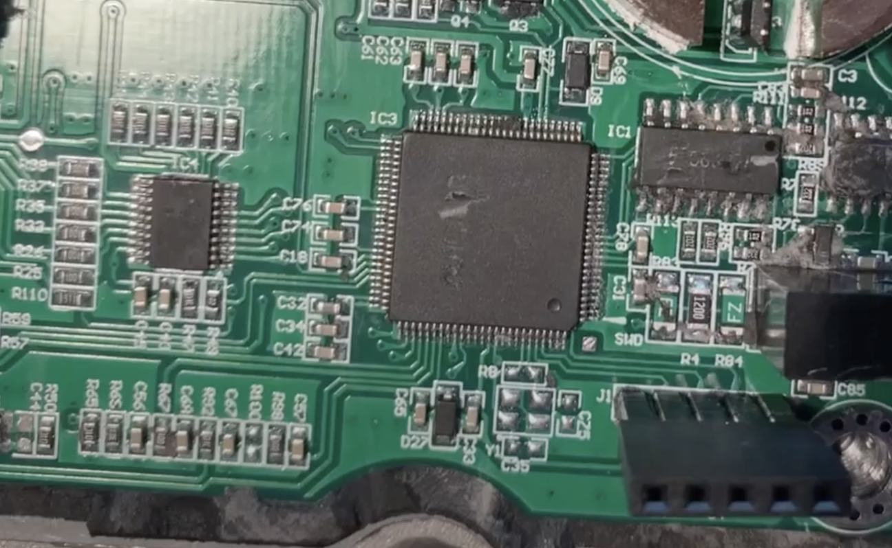
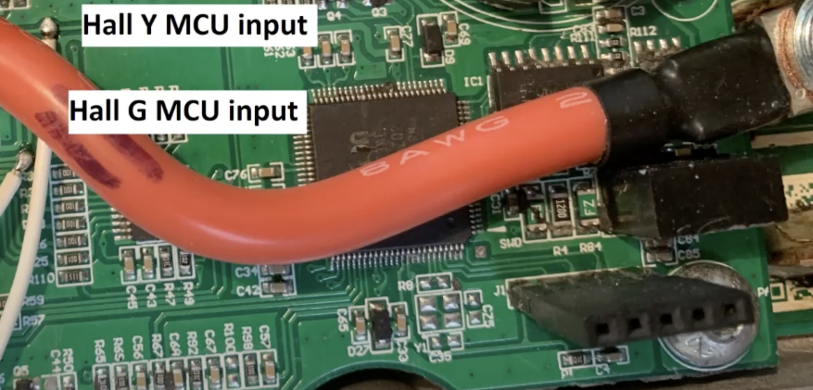
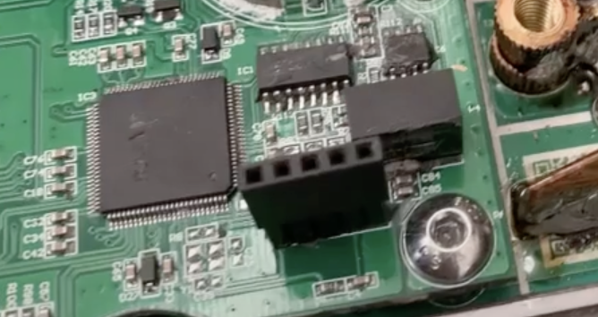

# Controller Hack Lighbee

# Overview
The project is still in its infancy and it is not yet clear if and when it will continue. So far, the hardware has been identified, an ICP connected and a little analyzed. In principle, modification of the firmware or an alternative is possible.  However, it has not yet been possible to bypass the hardware protection for readout.

**Approaches**  
- https://www.aisec.fraunhofer.de/en/FirmwareProtection.html
- https://github.com/bikemike/swdFirmwareExtractor

# Hardware
MCU nuvoton NM1530 Cortex M0 numicro
LQFP 100-pin
ARMv6-M Thumb instruction set, including a number of 32-bit instructions that use Thumb-2 technology.

# ICP

# Memory Layout
| Address                     |   Function                  |
|-----------------------------|-----------------------------|
| 0x0000_0000 – 0x0001_FFFF   |   FLASH_BA                  |
| 0x0001_F000 – 0x0001_FFFF   |   DATA_FLASH_BA             |
| 0x0010_0000 – 0x0010_1FFF   |   ISP_LOADER & LDROM ?      |
| 0x0020_0000 –               |   DATA_FLASH                |
| 0x0030_0000 – 0x0030_0007   |   CONFIG 0/1                |
| 0x2000_0000 – 0x2000_3FFF   |   SRAM_BA                   |
| 0x5000_0000 – 0x501F_FFFF   |   AHB Controllers Space     |
| 0x4000_0000 ~ 0x400F_FFFF   |   APB1 Controllers Space    |
| 0x4010_0000 ~ 0x401F_FFFF   |   APB2 Controllers Space    |
| 0xE000_E000 ~ 0xE000_EFFF   |   System Controllers Space  |

# Lock
Config0 (Address = 0x0030_0000)  
Security Lock Bit  
0 = Flash memory contentis locked  
1 = Flash memory contentis not locked  
When flash data is locked, only device ID, Config0 and Config1 can be read by writer and
ICP through serial debug interface. Others data is locked as 0xFFFF_FFFF. ISP can read
data anywhere regardless of LOCK bit value.  

http://www.nuvoton.com/resource-files/AN0001_NuMicro_Cortex-M_Code_Protection_EN_V1.00.pdf
