# Firmware Dump

# MCU MCU  R7F0C002L

Auf der MCU steht 0C002L, es handelt sich um einen R7F0C002L ([Datasheet](https://download.datasheets.com/pdfs/2016/6/14/3/45/23/168/ren_/manual/renesas_r7f0c001_2_2016-06-14_24-37-03.pdf))

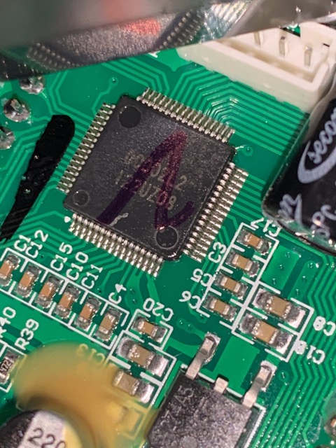

Der RL78 kommt als 64 Pin Version, folgende Grafik zeigt alle Anschlüsse.
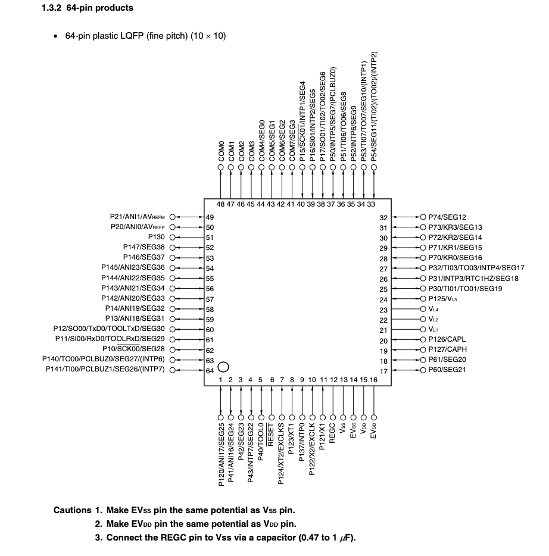

Die Verbindung mit einem Flash/OCD Adapter findet über TOOL0 Pin statt. Um den MCU neu zuprogrammieren eine Verbindung zu VSS, VDD, TOOL0 und Reset benötigt.   
- Der Reset-Pin kann direkt vom Kondensator C1 abgegriffen werden (Blau).  
- VSS (Cyan) und VDD (Blau) können am Spannungsregler abgegriffen werden.
- TOOL0 wird leider nicht herausgeleitet, der Anschluss muss direkt am PIN der MCU gelötet werden (Gelbes Kabel).

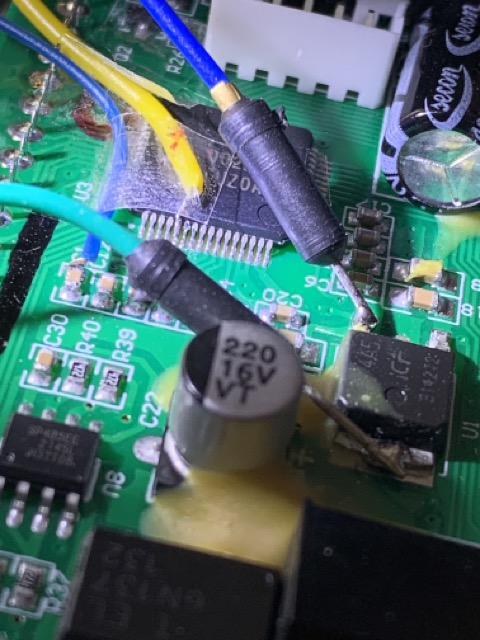


Stecker auf dem Board (JST-PH 2,0mm 5 Pin)

```code
 --       --
| 5 4 3 2 1 |
 -----------

1 = GND
2 = VCC
3 = Reset
4 = TOOL0
5 = ?
```


# Flash und OCD-Mode
Der RL78 wird über ein serielles Protokoll ([RL78 Protocol A](https://www.renesas.com/us/en/document/apn/rl78-microcontrollers-rl78-protocol-programmer-edition-application-note)) programmiert. 

Der Programmiermodus wird mit folgender Sequenz eingeleitet:

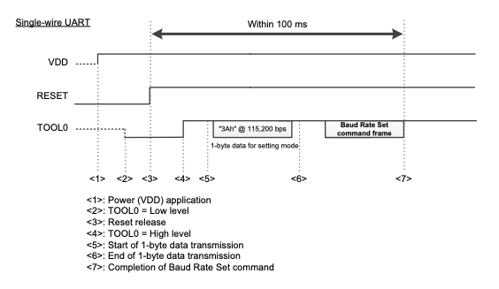  

Bei mir sieht es dann wie folgt in der Umgebung aus:

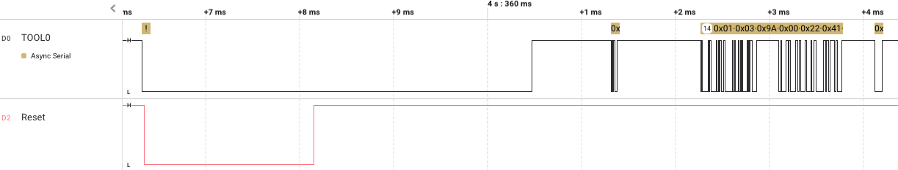

ps4_enthusiast von fail0verflow hat unter folgendem Link ein übersichtliches Pythonprogramm mit allen wichtigen Funktionen bereitgestellt:  
[rl78.py von ps4_enthusiast](https://github.com/fail0verflow/rl78-debug/blob/master/rl78.py)  
  

Beim Untersuchen des RL78 Protocol A wurden von ps4_enthusiast undokumentierte Funktionen identifiziert, die ein OCD (on chip debugging) ermöglichen. Darüber ist grundsätzlich ist auch das Auslesen des Flashs möglich.  
Der RL78 bietet einige Schutzfunktionen, sodass die OCD-Schnittstelle eingeschränkt werden kann, siehe:  
[RL 78 debugging functions](https://www.renesas.com/us/en/document/apn/rl78-debugging-functions-using-serial-port-application-note)  
[RL 78 debugging options](https://www.renesas.com/us/en/document/apn/rl78f13-f14-f15-option-byte-setting-rev101)

Der RL78 hier hat OCD aktiviert aber benötigt die richtige 10-Byte lange OCD ID, sonst wird der Zugriff verwehrt:

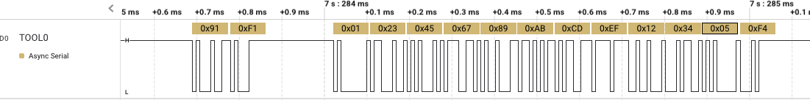

Nach dem cmd91 (unlock) antwortet der RL79 mir 0xF1, was bedeutet, dass die 10 stellige ID gesendet werden muss. In der Aufzeichnug wird 0123456789ABCEDF1234 + Checksumme gesendet. Der Chip quitiert mit 0xF4, was bedeutet, dass die ID nicht korrekt ist. Eigentlich kann der Flash bei ungültigem Code laut der Beschreibung gelöscht werden, scheint bei mit aber nicht zu passieren, Glück gehabt.


## Debug Protokoll

**OCD Protokoll 0xC5**

|CMD|Description| Return |
|---|-----------|--------|
|00 | SYNC      | 0x00       |
|90 | PING      | 0x03, 0x03|
|91 | UNLOCK    | 0xF0 ST_UNLOCK_ALREADY <br/> 0xF1 ST_UNLOCK_LOCKED<br/>0xF2 ST_UNLOCK_OK<br/>0xF3 ST_UNLOCK_SUM<br/>0xF4 ST_UNLOCK_NG
|92 | READ      |
|93 | WRITE     |
|94 | EXEC      |
|95 | EXIT_RETI |
|97 | EXIT_RAM  |
[Weitere Details siehe hier](https://fail0verflow.com/blog/2018/ps4-syscon/)


## Verkabelung, Löten, etc


## Erste Software zu Kommunikation
https://github.com/VV1LD/SYSGLITCH/blob/master/TEENSY_2.0%2B%2B/SYSGLITCH.ino


## Erster Test in Erwartung auf Debug-Verbot

Der OCD-Modus (Debug) wird mit 0xc5 eingeleitet, direkt danach wird die Baudrate sowie die Spannung festgelet. War das erfolgreich, antwortet der RL78 mit folgender Antwort (7 Byte Frame + 1 Byte Sync).

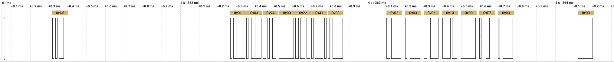

Wenn das Initiieren des OCD-Modes erfolgreich war, kann das erste Kommando getesetet werden. Ohne Entsperren des RL78 funktioniert nur das cmd90   (Ping).
Also wird das der erste Test:

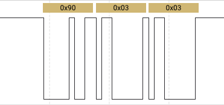

Das cmd90 (PING) liefert als Antwort Pong [0x03 0x03], es scheint also zu funktionieren!  

Der vollständige Zugriff wird erst nach dem entsperren mit cmd92 möglich, leider fehlt mir zu diesem Zeitpunkt die korrekte ocd id. Meine Anfrangen werden daher alle mit F4 quittiert. Sobald ein anderer OCD CMD verwendet wird, kommt es zum Reset.  

  

Wir brauchen also eine Möglichkeit die OCD ID zu ermitteln oder zu umgehen.

## Timing Attack, ohne Erfolg!

Mein erster Versuch war es, die Antwortzeit des RL78 auf das CMD91 zu messen. Mit ausreichender Auflösung und wenig Rauschen besteht die Chance, dass die Prüfung der einzelnen Bytes sequentiell erfolgt und sofort bei einem ungültigen Byte abgebrochen wird. Im Ergebnis sollte dann die Antwortzeit bei jedem gültigen Byte immer etwas länger werden, sodass sich Byte für Byte austesten lässt. Leider wurde der ROM Code des RL78 bzw. die Umsetzung der Prüfung gegen eine Timing Attacke gehärtet. ich konnte keinen signifikaten Unterschied im Antwortzeitverhalten messen.  
Am einfachsten kann man es einmal mit gültiger Checksumme (Antwort: F4) und einmal mit ungültiger Checksumme (Antwort:F3) testen, hier sollte die ungültige Checksumme bereits schneller die Antwort liefern. Das ist mir allerdings leider nicht geglückt, sodass ich jetzt zu härteren Mitteln greife ;)

Nachtrag:
Im ROM Code sieht man, wie der OCDID-Check implementiert wurde. Es wird unabhängig vom Inhalt immer der selbe Code durchlaufen. 
Eine Timing Attacke ist also definititv nicht möglich.
```                         
ROM:EFE82 8F F5 07                                MOV     A, ocd_flag
ROM:EFE85 4C 55                                   CMP     A, #55h
ROM:EFE87 DF 07                                   BNZ     try_unlock
ROM:EFE89 51 F0                                   MOV     A, #0F0h        ; send f0: unlock allready done
ROM:EFE8B FE 13 01                                CALL    tool_tx
ROM:EFE8E
ROM:EFE8E                         loc_EFE8E:                        
ROM:EFE8E EF A6                                   BR      ocd_loop_2
ROM:EFE90                         ; ---------------------------------------------------------------------------
ROM:EFE90
ROM:EFE90                         try_unlock:                       
ROM:EFE90 62                                      MOV     A, C      
ROM:EFE91 9F F4 07                                MOV     loc_F07F3+1, A
ROM:EFE94 51 F1                                   MOV     A, #0F1h      
ROM:EFE96 FE 08 01                                CALL    tool_tx         ; answer f1, ocd id needed
ROM:EFE99 53 0A                                   MOV     B, #0Ah       
ROM:EFE9B 36 C4 00                                MOVW    HL, #OIDID    
ROM:EFE9E 50 00                                   MOV     X, #0         
ROM:EFEA0 52 00                                   MOV     C, #0         
ROM:EFEA2 41 00                                   MOV     ES, #0        
ROM:EFEA4
ROM:EFEA4                         receive_ocd_id:                       
ROM:EFEA4 FE 0B 01                                CALL    tool_rx_0     
ROM:EFEA7 61 02                                   ADD     C, A          
ROM:EFEA9 11 2D                                   SUB     A, ES:[HL]      ; sub OCD ID                          <-- sub should be zero
ROM:EFEAB A7                                      INCW    HL            
ROM:EFEAC 61 68                                   OR      A, X          
ROM:EFEAE 70                                      MOV     X, A            ; Move Byte                           <-- 
ROM:EFEAF 93                                      DEC     B             
ROM:EFEB0 DF F2                                   BNZ     receive_ocd_id  
ROM:EFEB2                         receive checksum
ROM:EFEB2 FE FD 00                                CALL    tool_rx_0       
ROM:EFEB5 81                                      INC     A               
ROM:EFEB6 61 2A                                   SUB     A, C            
ROM:EFEB8 DF 0A                                   BNZ     wrong_checksum  
ROM:EFEBA D0                                      CMP0    X               ; check ocid, error if any bit is set     <-- if there any bit set?
ROM:EFEBB DD 1A                                   BZ      unlock_ok_second_check  
ROM:EFEBD 11 8F C3 00                             MOV     A, ES:OptionsBytes+3 
ROM:EFEC1 31 05 23                                BF      A.0, unlock_error ; if oid check enabled?
ROM:EFEC4
ROM:EFEC4                         wrong_checksum:                         
ROM:EFEC4 51 F3                                   MOV     A, #0F3h        ; Move Byte
```


## ID Check Voltage Glitch

Da die Timing Attacke auf das Unlock CMD nicht funktioniert hat, versuche ich es hier mit einem Votalge Glitch. Dieser Angriff wurde bereits mehrfach auf diese Art MCU durchgeführt. In der PS4 Szene gibt es verschiedene Aufbauten und Tools für den Syscon welche bei einigen Modellen auch auf dem RL78 basiert.
### Idee
Die eigentliche Idee stamm von [ps4_enthusiast](https://fail0verflow.com/blog/2018/ps4-syscon/) von fail0verflow der damit den ps4-syscon auslesen konnte.  
Zur Veranschaulichung hilft der Assembly-Auszug des RL78-Romcodes bei der Verarbeitung der ocd-cmds von ps4_enthusiast:

```cpp
handle_cmd_reset
 efe1f  bf  fffae.7, $efe1f ; while (MONSTA0.7 == 0) {}
 efe23  movw    ax, #833
delay_loop
 efe26  decw    ax
 efe27  cmpw    ax, #0
 efe2a  bnz $efe26        ; delay_loop
send_first_byte
 efe2c  clrb    a
 efe2d  set1    fffaf.6   ; ASIM.6 = 1
 efe30  clr1    fffaf.3   ; ASIM.3 = 0
 efe33  call    $!effa1   ; tool_tx(0)
read_cmd_loop
 efe36  mov a, !f0080     ; TOOLEN
 efe39  cmp a, #202
 efe3b  bnz $efe3b        ; if (TOOLEN != ca) { hang }
 efe3d  call    $!effb2   ; tool_rx
 efe40  mov x, a
 efe41  cmp0    a
 efe42  bz  $efe1f        ; handle_cmd_reset
 efe44  cmp a, #144
 efe46  bz  $efe76        ; handle_cmd_90
 efe48  cmp a, #145
 efe4a  bz  $efe82        ; handle_cmd_91
 efe4c  mov a, !f07f5
 efe4f  cmp a, #85        ; if (ocd_flag != 0x55)
 efe51  bnz $efe1f        ; handle_cmd_reset
 efe53  mov a, x
 efe54  cmp a, #146
 efe56  bz  $efe6a        ; handle_cmd_92
 efe58  cmp a, #147
 efe5a  bz  $efe6d        ; handle_cmd_93
 efe5c  cmp a, #148
 efe5e  bz  $efe70        ; handle_cmd_94
 efe60  cmp a, #149
 efe62  bz  $efe73        ; handle_cmd_95_97
 efe64  cmp a, #151
 efe66  bz  $efe73        ; handle_cmd_95_97
 efe68  br  $efe36        ; read_cmd_loop
```

Beim Versuch mit cmd_93 zu schreiben wird das ocd_flag (f07f5) geprüft, wenn der Chip nicht voherher via cmd_91 entsperrt wurde, erfolgt ein Reset!
```cpp
 efe4c  mov a, !f07f5
 efe4f  cmp a, #85        ; if (ocd_flag != 0x55)
 efe51  bnz $efe1f        ; handle_cmd_reset
```
  
**Die Suche nach einem geeigneten Glitchfenster:**  
Die Idee ist es, genau einen Glitch nach dem Absetzen des Schreibkommandos (cmd_93) zu setzen und die Sperre zu umgehen.
Ohne Freischaltung des RL78 sieht doe Kommunikation wie folgt aus:
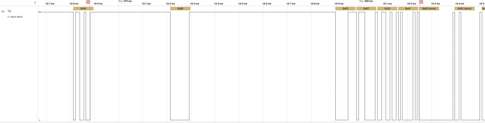
   
Wie im Bild zu sehen, wird ca. **333 us** nach dem cmd_93 vom RL78 ein 0-Byte gesendet. Wird nun direkt weitergesendet, kommt es bei den nachfolgenden Daten zu framing-errors, da durch den Reset des RL78 die Tool0-Leitung scheinbar mehrfach gegen GND gezogen wird. Das sieht man auch im Echo und kann ausgelesen werden.  
Was für mich noch nicht ganz klar war, ist das 0-byte wie beim Baudrate-Cmd ein Sync-Byte oder ist es die Rückmeldung für das Reset-CMD. Also muss vor oder nach dem 0-Byte der Glitch angesetzt werden.  
Da nach dem Assembly oben mit cmd0 im ocd-Mode der selbe code durchlaufen wird, ist das der nächste Test.
  
  
Gesagt getan, also cmd00 (Reset) liefert folgendes Signal:

 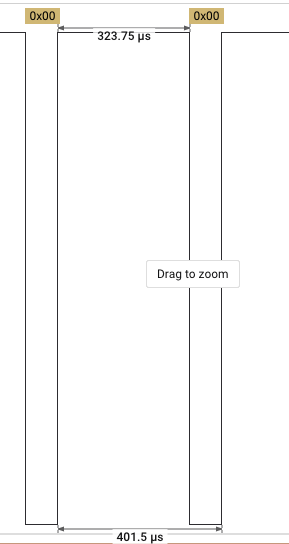

 Nach **323us** kommt die 0-byte Anwort, also liegt unser Glitch-Fenster scheinbar zwischen cmd_93 und der Reset-Anwort 0x00!
  
   
  
Weitere Links:
https://pretalx.fri3d.be/media/fri3dcamp2022/submissions/8CPY83/resources/nl22vfi_df3J7R7.pdf


### Softwareanapssung
Als HW habe ich den ESP32 verwendet, die Software liegt unter RL78Glitch. 

### Hardware mit Mosfet 
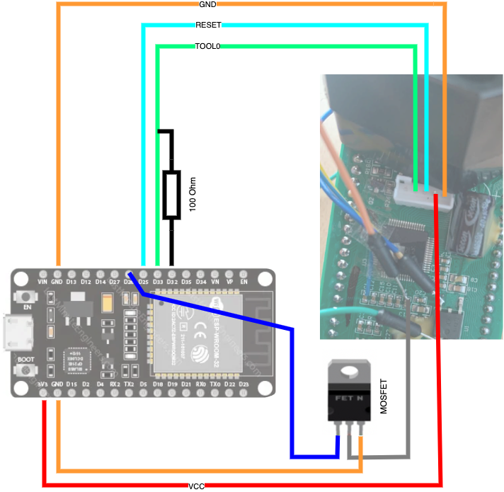

### Modding
## LCD
40 Pin Lcd Custom Segment

### Flash

```code
Adresse: F1000 (Dataflash, Virgin)  
00 01 02 03 04 05 06 07 08 09 0A 0B 0C 0D 0E 0F 10 11 12 13 14 15 16 17
CS CS AA AA AA BB BB BB CC ?? DD DD EE EE FF FF GG HH II II JJ JJ ?? ??
00 00 E0 07 26 41 00 34 00 00 00 11 89 FC A1 FF 0E A5 15 44 00 00 DF F3

Adresse: F1400: (Dataflash)
3E 13 C6 11 00 A8 11 00 00 FF A8 11 A8 11 FE 01 00 55 82 00 64 00 FF FF
95 D2 C7 11 00 A9 11 00 00 FF A9 11 A9 11 FE 01 00 55 82 00 64 00 FF FF
92 4F C8 11 00 AA 11 00 00 FF AA 11 AA 11 FE 01 00 55 82 00 64 00 FF FF
DF 68 C9 11 00 AA 11 00 01 FF AA 11 AA 11 FE 01 00 55 82 00 64 00 FF FF  <- change mode
13 98 CC 11 00 AA 11 00 01 FF 00 00 AA 11 FE 01 00 00 82 00 64 00 FF FF  <- reset total
A7 AB CD 11 00 AA 11 00 01 FF 00 00 AA 11 FE 01 00 00 64 00 64 00 FF FF  <- übersetzung von 1.3(0x82, 130) auf 1.0(0x64, 100)

XX XX XX XX XX XX XX XX       XX XX XX XX          XX
F14D8
       X        X              X     X   


AA = word_FFB7C word_FFB7A = Savecounter   stored as little endian
BB = word_FFB6E  word_FFB6C Total Distance, 24 Bit?
CC = byte_FFB22     Display (KM/h/ Trip)
DD = word_FFB72     Trip Distance
EE = word_FFB74     Total Distance, 16 Bit?
FF = word_FFB06 + word_FFB04 eepromUnknow2  init:0 min:0 max:5       FFB06(Divisor speed, Default: 0x1FE (510),  Min:20 Max:4000  ? eepromUnknow1
GG = byte_FFB85 + byte_FFB84        FFB84=KM(0)/Miles(1),  byte_FFB85=flag? eepromUnknow3
HH = byte_FFB87     Trip Max Speed
II = word_FFB0A     Gear Ratio / 100
JJ = word_FFB0C     min:20 max:300    Default: 0x64 (100)   eepromUnknow4

CRC-16/KERMIT: 0x8AFF
```

### Distance Algo
Übersetzungsverhätlnis: 1:7.6
Maximale Drahzahl:      5400 rpm
Radumfang:  1.9m oder 1.95m? 

precalulated_val=   // on startup
  a = 55556 / eepromUnknow1 (510)
  a = a * 100
  a = a / gear_ratio (100)
  a = a * eepromUnknow4(100)
  a = a / 100
  a = a+1

109.93333333333334

timerpulse:
  val += precalulated_val 
  
  
calc_distance:
val / 134464 = n 100m 


100m   / 100 * radumfang = 1 umdrehung / faktor
134464 / 100 *1.9 / 109.93 / 7.6

7.6 / 1.9 * 109.93 * 100 / 134464
1.9
----------


### UART
```code
UART:

57 83 ?? CMD LEN D1 .. Dn CS
CMD
:48
:4B

komische msg:   ROM:4FDF
01 02 03 04 05 06 07 08 09 0A 0B 0C 0D 0E 0F 10 11 12 13 14 15 16 17 18 19
57 83 92 15 ?? 00 FF 01
:1F
:2E
:3D
:4C
``` 

### HW 
LEDs:  
- Left  
- Ready
- Attention
- Right
- Light
- Batterie

Input:  
- Kickstand
- Speedo
- Left
- Right
- Button Left
- Button Right

### Ports

Speedo:    P3.0    TI01

In:  
P12.1   3789          
P12.2   3789  
P12.3   sub_397A, store var_FFB1D  
P13.7   48D0  


Out:  
MASK: b00000111  
P1.0      

MASK: b11111110  
P12.5  
P12.6   
P12.7    set by 399F var_FFB1D  

P13.0

MASK: 0  
PP14.4   4898  
PP14.5   4898  
PP14.6   4898  

### Übersetzung

Primärantrieb:  
    Primärantrieb Ritzel 13T      Antriebskettenrad 30             (Übersetzung:  1:2.31)  
Secondär       
48 Zähne / 106 Glieder Original  

Maximale Motordrehzahl hatte ich laut https://sur-ron.rocks/light-bee auf 5400 (sicher ungedrosselt, gedrosselt ist sie ja mWn nur durch die Drehzahl!?), 
aber Primärübersetzung kenne ich nicht und wird mir auch zu kompliziert. :p 
Die Übersetzung geben die mit 1:7,6 an. Bei 14 oder 15er Ritzel (!?) und 48er Kettenrad.
Was mich interessiert: Gedrosselt, welchen Einfluss hat mein größeres Hinterrad? Vernachlässigbar?
Ungedrosselt wie schnell fährt sie berechnet orginal und mit 60er Kettenrad.