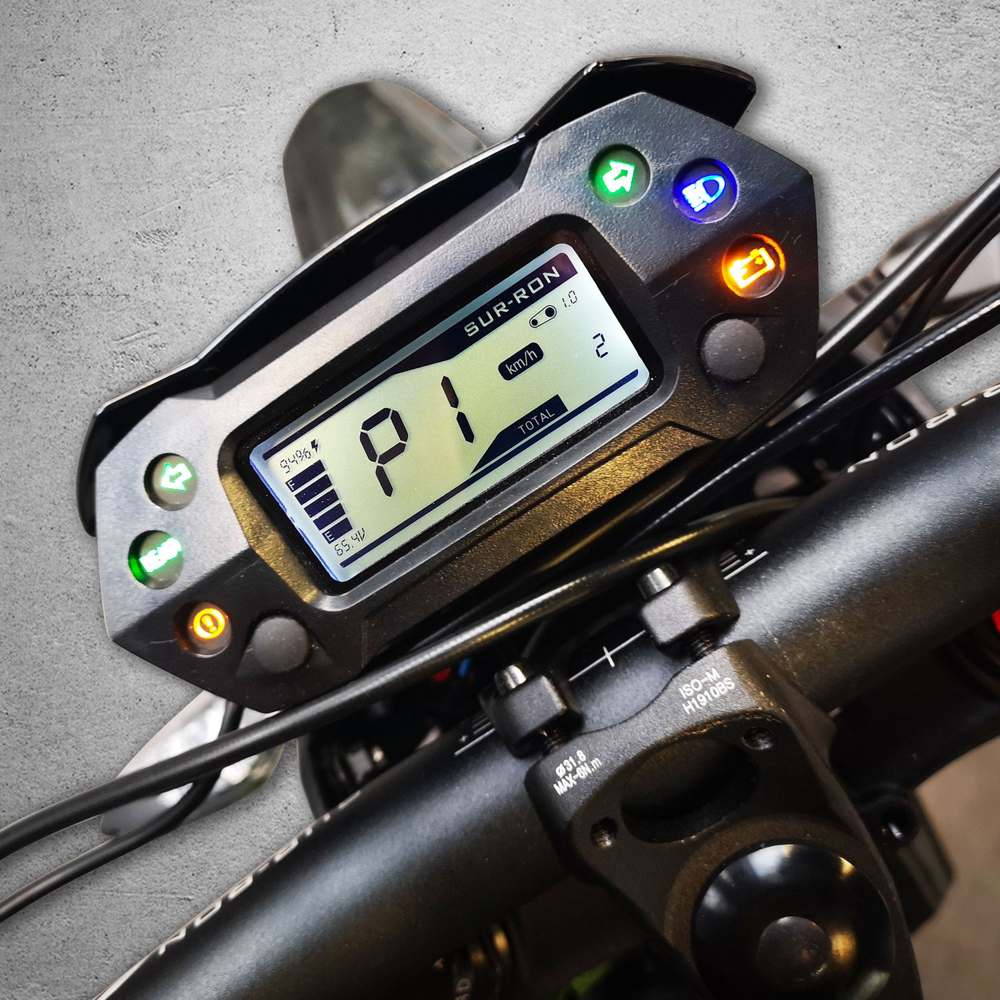
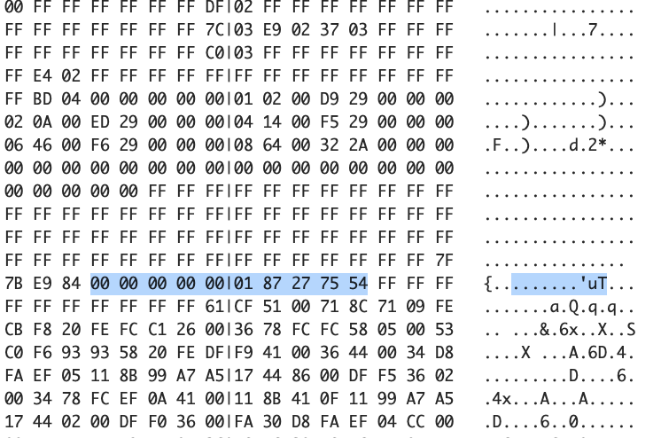
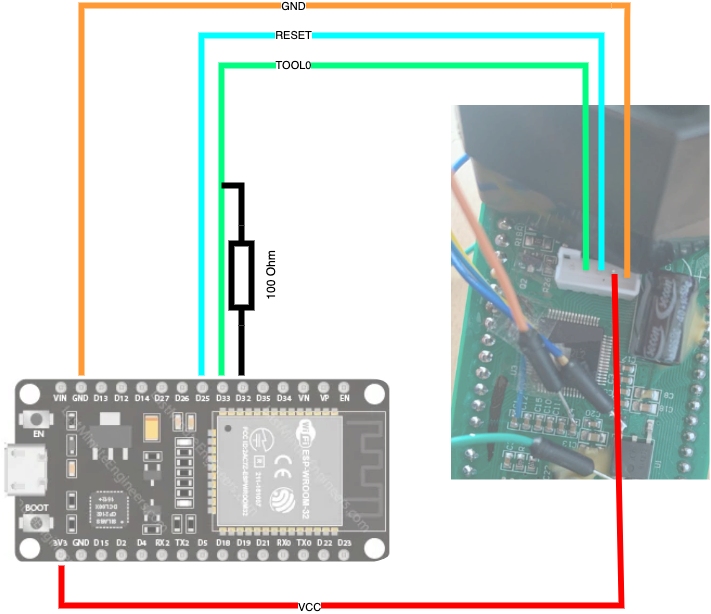

# Speedometer Hack Lighbee



# Overview
The speedometer of the Sur-Ron LightBee is based on an RL78 (R7F0C002L) MCU.  This project uses an ESP32 as programmer to read, adapt and write the firmware of the speedometer. 

The main part of the programmer code is based on the following project by ps4_enthusiast from fail0verflow:
[rl78.py von ps4_enthusiast](https://github.com/fail0verflow/rl78-debug/blob/master/rl78.py) 

The challenge was to read out the original firmware. The RL78 offers some protections so that the OCD interface can be restricted. A 10-byte OCD ID was set for the Sur-Ron and the necessary OCD functions can only be executed with this.
To cut a long story short, the key is: 



The detailed explanation and how the key was relatively easy to read with a glitch attack can be found in the "investigation" folder 


I found it stupid, for example, that the maximum speed was permanently stored in the EEPROM and can therefore be checked by the race organizers at any time ;)  
I don't need this function and it can't be found in any other speedometer I know of. 

Another idea, which has not yet been realized, would be to measure the speed and distance directly from the wheels using a Hall sensor rather than the transmission. This would increase accuracy and would be independent of the gear ratio used.

# Requirements
- Sur-Ron Lightbee speedometer
- ESP32 or ESP8266*
- Resistor 100-200 Ohm
- some cables
- ideally a suitable connector (5 pin JST-PH 2.0mm)
- python 3

*(I had just lying around, actually any other Arduino-like MCU should work as well)

# Preparation

## Compile & flash the programmer
You will find the sources as a platformio project in the "programmer" directory. It can, for example, be compiled in Visual Studio Code with platformio installed and directly written to the ESP32.
In principle it is nothing more than a UART relay, which in the first step executes the necessary sequence to put the RL78 into programming mode.

## Connect programmer and speedometer
Open the speedometer and carefully pull out the circuit board. There is a 5 pin connector on the circuit board. It is a 5 pin JST-PH 2.0mm and the assignment is as follows:
```code
 --       --
| 5 4 3 2 1 |
 -----------

1 = GND
2 = VCC
3 = Reset
4 = TOOL0
5 = ?
```
I got myself a suitable plug and connected an ESP32 as a programmer as follows:




# Usage
Once everything has been set up, we can start programming. The necessary python script is located in the "programmer/tools" folder. 

You need to know which port or device you are using to access the ESP32 serial. I am currently using MacOs, for example, and for me it is "/dev/cu.usbserial-0001"

Change to this folder and run the script...


## Check Connection
```shell
python3 rl78tool.py info -p /dev/cu.usbserial-0001 

enter bootloader mode: 3A
sig: b'10000652374630433030324c20ff7f00ff170f030003'
sec: b'fe0300001f00ffff'
Done!
```

## Backup Firmware

**Dump Firmware**
```shell
python3 rl78tool.py read -p /dev/cu.usbserial-0001 -a 0 -l 0x8000 -o firmware.bin

Check OCD Version: True
OCD Unlock: True
start reading at address: 0x000000 ...
writing output file 'firmware.bin'
Done!
```

**Dump EEPROM**
```shell
python3 rl78tool.py read -p /dev/cu.usbserial-0001 -a 0xF1000 -l 0x800 -o eeprom.bin 

enter bootloader mode: C5
Check OCD Version: True
OCD Unlock: True
start reading at address: 0x0F1000 ...
dumping 0F1000 - 0F17FF
writing output file 'eeprom.bin'
Done!
```

**Dump Whole**
```shell
python3 rl78tool.py read -p /dev/cu.usbserial-0001 -a 0 -l 0x100000 -o fulldump.bin 

enter bootloader mode: C5
Check OCD Version: True
OCD Unlock: True
start reading at address: 0x000000 ...
dumping 000000 - 00FFFF
dumping 010000 - 01FFFF
...
dumping 0E0000 - 0EFFFF
dumping 0F0000 - 0FFFFF
writing output file 'fulldump.bin'
Done!
```

## Firmwareinfos

**print binary Infos**
```shell
python3 surtool.py info -i firmware.bin

name: firmware.bin
size: 32768
type: flash
md5: 83e667a0d8874003e57baf742980cb42 => known firmware
```


**print Surron EEPROM Infos**
```shell
python3 surtool.py eeprominfo -i eeprom.bin

last record: {'offset': 1528, 'crc': 30633, 'calculated_crc': 30633, 'record_id': 1141, 'total_distance': 105.1, 'display_mode': 1, 'trip_distance': 4, 'total_distance_16b': 105.1, 'trip_maxspeed': 47, 'gear_ratio': 1.3}
```


## Write Firmware
```shell
python3 rl78tool.py program -p /dev/cu.usbserial-0001 -a 0 -i firmware.bin 
```

## Write EEPROM
```shell
python3 rl78tool.py program -p /dev/cu.usbserial-0001 -a 0xF1000 -i eeprom.bin
```


## Modify Firmware

The "patches.json" file contains a number of firmware patches that can be integrated using the "surtool.py" script. The firmware must be read out beforehand and reinstalled after patching.

Example:  
```
python3 surtool.py patchfirm -i firmware.bin -o test.bin -p remove_maxspeed
```

|Patchname | Description | Tested|
|-----------------|-------------|------|
| remove_maxspeed | The patch completely removes the maximum speed display | yes |
| remove_surron_label | removes the surron label from the speedometer | no |
| remove_bottomline | removes the bottomline from the speedometer | no |
| dont_store_speed | dont store/ load max speed from/to eeprom | no |


### Disassemble Firmware

You can use Ghidra or IDA to disassemle the firmware.  
The RL78 MCU seems to be directly supported in current IDA versions. For Ghidra, the processor module must first be installed: 
https://github.com/xyzz/ghidra-rl78


### use RL78 toolchain
The RL78 toolchain is available as a Docker image and can therefore be used very easily to create code snippets.
https://hub.docker.com/r/msalau/rl78-elf-gcc

#### Compile Binary
Compile asm file to binary
```shell
docker run --rm -v "$(pwd):/src" msalau/rl78-elf-gcc rl78-elf-as -o test.bin test.asm
```
 
or

Compile C file to binary
```shell
docker run --rm -v "$(pwd):/src" msalau/rl78-elf-gcc rl78-elf-gcc -Ttext=0xF07E0 -nostdlib -o test.bin test.c
```
#### Strip binary to get just code

```shell
docker run --rm -v "$(pwd):/src" msalau/rl78-elf-gcc rl78-elf-objcopy -O binary --only-section=.text --image-base 0xF07E0 test.bin test.code
```

#### Dump the disassembly 

```shell
docker run --rm -v "$(pwd):/src" msalau/rl78-elf-gcc rl78-elf-objdump --adjust-vma=0xf07e0  -b binary -m RL78 -D test.code 
```


# Thanks & Greetz
- PoroCYon 
- ps4_enthusiast
